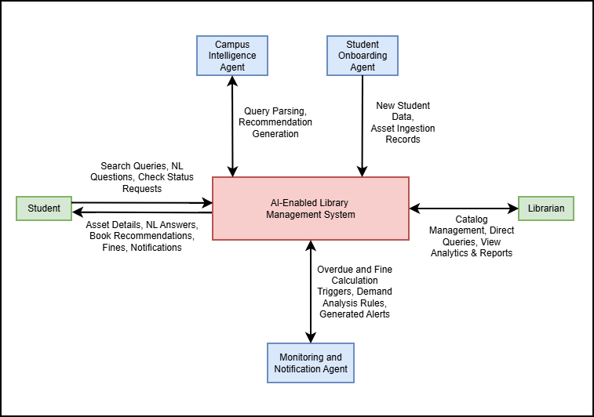
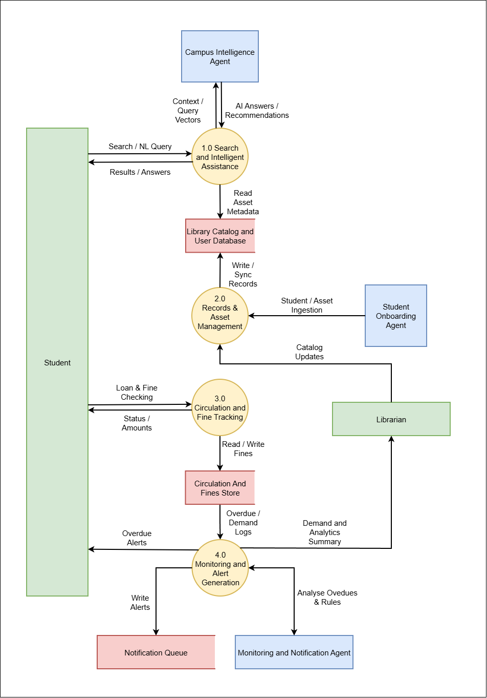
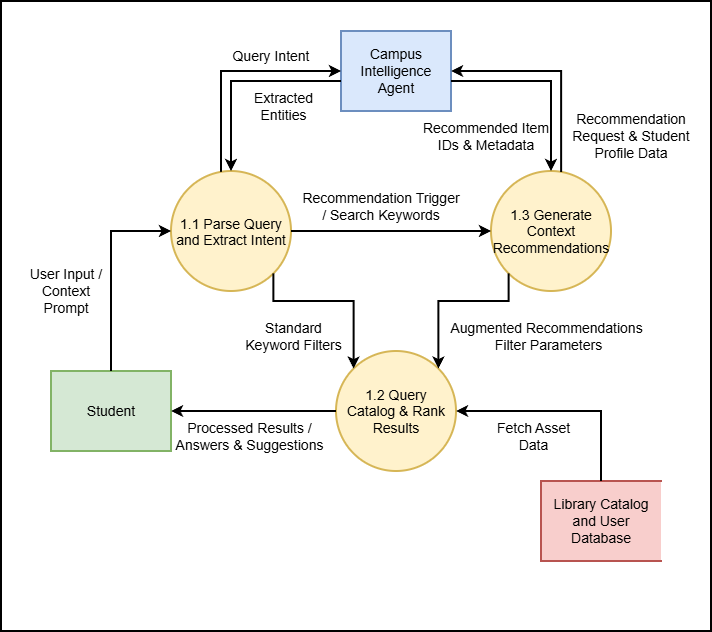
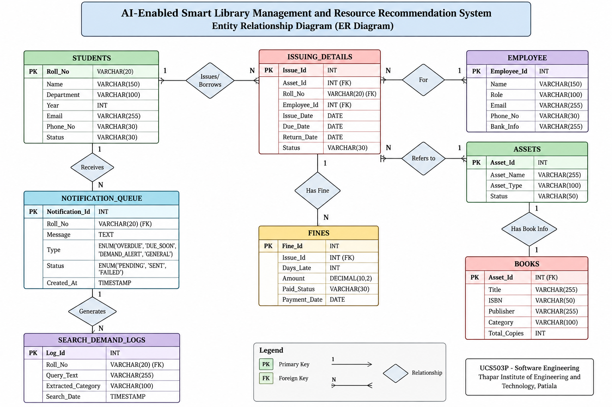
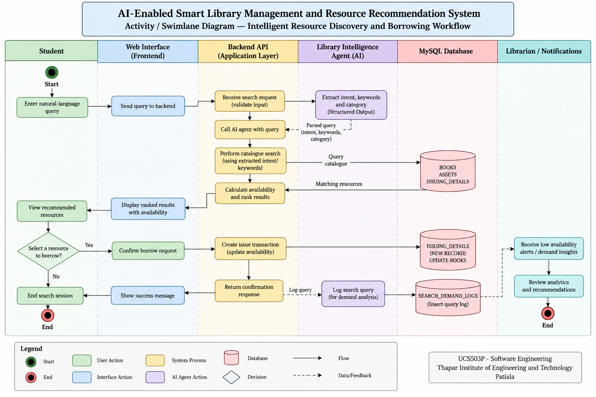

# 📚 AI-Enabled Smart Library Management and Resource Recommendation System

> **UCS503P — Software Engineering Project**  
> Thapar Institute of Engineering and Technology, Patiala

[](https://github.com/zzzelicrem/SE_AI-EnabledSmartLibraryManagementSystem)
[](https://github.com/zzzelicrem/SE_AI-EnabledSmartLibraryManagementSystem)
[](https://www.python.org/)
[](https://www.mysql.com/)
[](https://react.dev/)
[](https://fastapi.tiangolo.com/)

---

## 👥 Team

| Roll No. | Name | Role |
|----------|------|------|
| **1024160010** | **Arnav Agarwal** | Primary Author |
| **1024160135** | **Aradhya Goyal** | Team Member |
| **1024160025** | **Amanjot Kaur Sidhu** | Team Member |

**Lab Instructor:** Dr. Jeelani Asif

**Program:** B.E. Third Year, Computer Science and Engineering  
**Institution:** Thapar Institute of Engineering and Technology, Patiala

---

## 🧠 Project Overview

The **AI-Enabled Smart Library Management and Resource Recommendation System** is a web-based platform that combines conventional library management workflows with controlled AI-assisted functionality.

The system provides:

- 📚 Book and resource management
- 👨‍🎓 Student/member management
- 🔄 Issue and return management
- ⏰ Overdue monitoring
- 💰 Fine tracking
- 🔎 Natural-language resource discovery
- 🔔 Automated notifications
- 📊 Library analytics and recommendations

The project follows a **modular 3-tier architecture** integrated with a controlled AI agent layer.

---

## 🎯 Objectives

The project aims to:

1. Develop a centralized digital library management platform.
2. Enable natural-language resource discovery.
3. Provide availability-aware recommendations.
4. Support bulk student and resource record onboarding.
5. Detect potentially duplicate records.
6. Automate overdue and fine monitoring.
7. Generate notifications for overdue resources.
8. Provide useful library analytics and recommendations.
9. Maintain controlled and reliable AI-database interaction.

---

## 🏗️ System Architecture

```text
                    ┌─────────────────────────┐
                    │   Student / Admin UI    │
                    │      React / Web        │
                    └────────────┬────────────┘
                                 │
                                 ▼
                    ┌─────────────────────────┐
                    │    Backend REST API     │
                    │    FastAPI / Python     │
                    └────────────┬────────────┘
                                 │
              ┌──────────────────┼──────────────────┐
              │                  │                  │
              ▼                  ▼                  ▼
       ┌─────────────┐   ┌─────────────┐   ┌─────────────┐
       │   Library   │   │   Record    │   │   Library   │
       │Intelligence │   │ Onboarding  │   │ Monitoring  │
       │    Agent    │   │    Agent    │   │    Agent    │
       └──────┬──────┘   └──────┬──────┘   └──────┬──────┘
              │                  │                  │
              └──────────────────┼──────────────────┘
                                 │
                                 ▼
                    ┌─────────────────────────┐
                    │      MySQL Database     │
                    │                         │
                    │ Students                │
                    │ Employees               │
                    │ Assets / Books          │
                    │ Issuing Details         │
                    │ Fines                   │
                    │ Notifications           │
                    │ Search Logs             │
                    └─────────────────────────┘
````

---

## 🤖 AI Agent Layer

### Library Intelligence Agent

Handles natural-language resource discovery by:

* Extracting search intent and keywords.
* Identifying relevant categories.
* Searching the library catalogue.
* Checking resource availability.
* Returning ranked recommendations.

### Record Onboarding Agent

Supports bulk record ingestion by:

* Validating incoming records.
* Checking required fields.
* Detecting duplicate records.
* Performing fuzzy matching.
* Preparing valid records for controlled database insertion.

### Library Monitoring Agent

Supports automated monitoring by:

* Detecting overdue resources.
* Calculating overdue fines.
* Generating notification entries.
* Monitoring library activity.

AI agents interact with the database only through controlled backend APIs and tools.

---

## 🔐 Safety and Reliability

The system separates AI-assisted functionality from deterministic database operations.

* Parameterized database queries
* Input validation using Pydantic
* Controlled AI tool access
* No unrestricted SQL access for AI agents
* Transactional database operations
* Error handling and validation
* AI fallback to conventional keyword-based search
* Automated testing and CI/CD

---

## 📂 Repository Organization

```text
SE_AI-EnabledSmartLibraryManagementSystem/
│
├── .github/
│   └── workflows/
│
├── agents/
│   ├── cia_agent.py
│   ├── soa_agent.py
│   └── mna_agent.py
│
├── backend/
│   ├── app/
│   │   ├── main.py
│   │   ├── database.py
│   │   ├── models/
│   │   ├── schemas/
│   │   ├── routes/
│   │   └── services/
│   └── tests/
│
├── frontend/
│   └── src/
│       ├── components/
│       ├── pages/
│       └── services/
│
├── config/
│
├── database/
│   └── schema_extensions.sql
│
├── docs/
│   ├── Diagrams/
│   │   ├── DFD_Level0.png
│   │   ├── DFD_Level1.png
│   │   ├── Level_2_DFD.png
│   │   ├── ER_Diagram.png
│   │   ├── SwimLane_Diagram.png
│   │   └── Use Case Diagram.png
│   └── index.md
│
├── journals/
│   ├── 1024160010-ArnavAgarwal/
│   ├── 1024160135-Aradhya/
│   └── 1024160025-Amanjot/
│
├── tests/
├── README.md
├── Makefile
└── LICENSE
```

---

## 🗄️ Database

The system uses **MySQL** as its relational database.

### Core Tables

| Table                | Purpose                       |
| -------------------- | ----------------------------- |
| `STUDENTS`           | Student/member records        |
| `EMPLOYEE`           | Library employee records      |
| `ASSETS`             | Library asset records         |
| `BOOKS`              | Book catalogue                |
| `ISSUING_DETAILS`    | Issue and return transactions |
| `FINES`              | Fine records                  |
| `NOTIFICATION_QUEUE` | Notification management       |
| `SEARCH_DEMAND_LOGS` | Search activity logging       |

---

## 🔎 Intelligent Search

```text
Natural-Language Query
          │
          ▼
Library Intelligence Agent
          │
          ▼
Intent / Keyword Extraction
          │
          ▼
Controlled Backend API
          │
          ▼
Catalogue Search
          │
          ▼
Availability Check
          │
          ▼
Ranked Recommendations
```

The system uses current circulation data to provide availability-aware results.

---

## ⏰ Overdue Monitoring

```text
ISSUING_DETAILS
       │
       ▼
Check Due Date
       │
       ▼
Calculate Days Late
       │
       ▼
Calculate Fine
       │
       ▼
FINES
       │
       ▼
Notification Queue
```

Overdue detection and fine calculation are handled through deterministic backend/database logic.

---

## 📐 System Diagrams

### Use Case Diagram


### Level 0 — Context DFD



### Level 1 — System DFD



### Level 2 — Intelligent Search DFD



### Entity Relationship Diagram



### Activity / Swimlane Diagram



---

## 🌐 API Endpoints

| Method | Endpoint                              | Purpose                          |
| ------ | ------------------------------------- | -------------------------------- |
| `POST` | `/api/search/intelligent`             | Natural-language resource search |
| `POST` | `/api/ingestion/sync`                 | Bulk record ingestion            |
| `GET`  | `/api/circulation/fines/{student_id}` | Student fine information         |
| `POST` | `/api/cron/monitor-overdues`          | Overdue monitoring               |

---

## 🧪 Evaluation

The prototype is evaluated using measurable software engineering criteria.

| Metric                        |       Target |
| ----------------------------- | -----------: |
| Resource discovery time       | ≤ 10 seconds |
| Duplicate detection precision |        ≥ 90% |
| Overdue detection coverage    |        ≥ 99% |
| Recommendation accuracy       |        ≥ 90% |
| API median response time      |     ≤ 500 ms |
| Automated test coverage       |        ≥ 70% |

---

## 🛠️ Technology Stack

| Component       | Technology               |
| --------------- | ------------------------ |
| Frontend        | React                    |
| Backend         | FastAPI / Python 3.11+   |
| Database        | MySQL                    |
| AI              | LangChain / OpenAI API   |
| Validation      | Pydantic                 |
| API             | REST                     |
| Testing         | Python Testing Framework |
| Version Control | Git / GitHub             |
| CI/CD           | GitHub Actions           |

---

## 🚀 Development Approach

The project follows an incremental software engineering approach:

```text
Requirements
     ↓
Core MVP
     ↓
Database + Backend
     ↓
Frontend Integration
     ↓
AI Integration
     ↓
Testing
     ↓
Evaluation
     ↓
Deployment
```

The development process emphasizes rapid time-to-value, incremental implementation, continuous integration, testing, and measurable evaluation.

---

## 📌 Project Status

**Status: Prototype**

The current prototype establishes the system architecture, database design, core workflows, AI-agent design, system diagrams, and project documentation.

---

## 📄 Documentation

Project documentation includes:

* Project Proposal
* Prototype Report
* Final Project Report
* System Architecture
* Use Case Diagram
* Data Flow Diagrams
* ER Diagram
* Activity/Swimlane Diagram
* Database Design
* Development Journals

---

## 👨‍💻 Team

**Arnav Agarwal** — 1024160010
Primary Author

**Aradhya Goyal** — 1024160135
Team Member

**Amanjot Kaur Sidhu** — 1024160025
Team Member

**Lab Instructor:** Dr. Jeelani Asif

---

© 2026 Arnav Agarwal, Aradhya Goyal, and Amanjot Kaur Sidhu
**UCS503P — Software Engineering Project**
**Thapar Institute of Engineering and Technology, Patiala**

